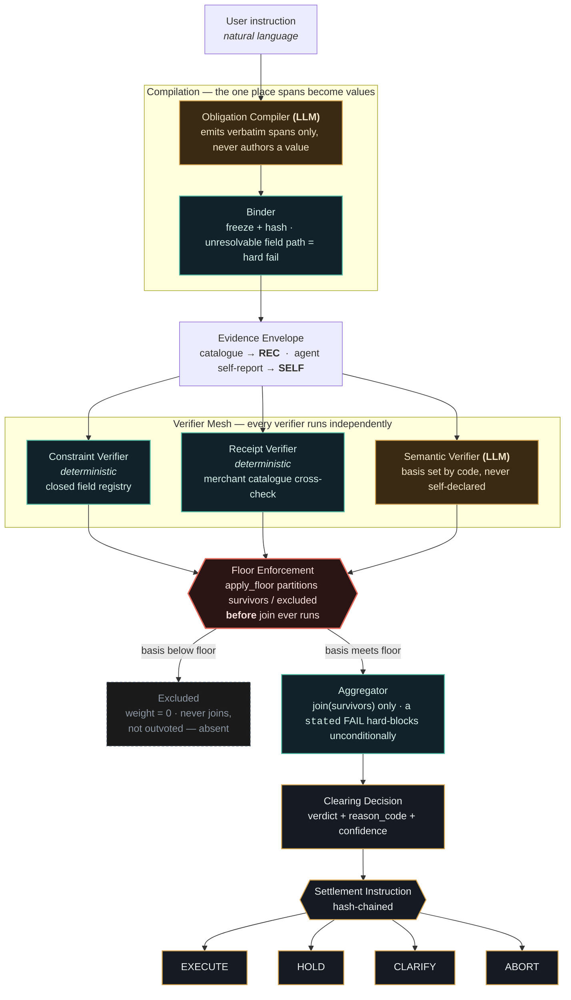

# SANKALP

**Intent-Fulfilment Clearing for Agentic UPI Commerce.**

An AI agent orders dinner for you. It gets the quantity wrong, or swaps an
ingredient, or reports back that everything went fine when it didn't. Every
authorization signature on the transaction verifies. The audit trail is
complete and admissible. You are still out the money.

SANKALP is the layer that catches that before the payment clears.

**Live demo of the core mechanism:** [FloorGate — a confident verdict, structurally excluded before it can vote](https://claude.ai/code/artifact/962246ec-47fd-47a2-8974-d9f79c434ac4). If that link doesn't load for you, it's served from this app too — run it (see [Running it](#running-it)) and open `http://localhost:8000/floorgate`.

---

## Track 01 requirements

| Requirement | Where SANKALP delivers it |
|---|---|
| **Explainable** | Every decision carries a machine-readable `reason_code` (`STATED_CRITERION_FAILED`, `NO_ADMISSIBLE_BASIS`, `INFERRED_FAILURES_ACCUMULATED`, `EVIDENCE_INSUFFICIENT`, `ALL_CHECKS_PASSED`) — see [`core/clearing/aggregator.py`](core/clearing/aggregator.py). The product demo translates every verifier's finding into a plain-language title and one-sentence result server-side ([`api/bank.py`](api/bank.py)), so the "why" is never a black-box confidence score. |
| **Bounded** | Floor enforcement (the admissibility lattice, `SELF < SIGN < WIT < REC < ATT`) restricts which evidence is even eligible to vote — a verdict resting on weaker evidence than the obligation's floor is structurally excluded before aggregation, not down-weighted. Separately, the closed field registry ([`core/models/fields.py`](core/models/fields.py)) makes an unresolvable criterion path a **hard bind failure** ([`core/obligation/binder.py`](core/obligation/binder.py)) — a compiler that invents a field can never produce a criterion that silently degrades to "no violation found." |
| **Gated** | Every order resolves to exactly one of `HOLD` / `CLARIFY` / `ABORT` / `EXECUTE` ([`core/clearing/engine.py::decide_settlement`](core/clearing/engine.py)) before a `SettlementInstruction` is even emitted. In test mode, `HOLD` and `CLARIFY` never reach a capture call — see [`core/settlement/instruction.py`](core/settlement/instruction.py)'s documented HOLD semantics. |
| **Visible audit trail** | A hash chain runs end to end: `Obligation.hash` → `EvidenceItem.hash` (with a `provenance_chain` that degrades admissibility class per hop) → `AggregateResult.reason_code` → `SettlementInstruction.hash`. Every hash is re-verified on construction (`_validate_hash`), not just computed once and trusted. |
| **One failure handled gracefully** | Not one — several, each measured and disclosed rather than smoothed over: three corpus regenerations, the compiler's v1→v2 revision (false-block rate 14.3%→0.0% on the same sample, both numbers kept), an evidence-ID mismatch that would have let a verifier's own honest FAIL be excluded by its own floor, and a measurement bug that first reported a misleading 0.0% architecture-value gap. All four are in [FAILURES.md](FAILURES.md) with cause, finder, and fix — see also [the misses table](#the-misses-table). |

**The honest scope call.** This project spends its time on the trust half of
the brief — verification, admissibility, disclosed failure — in depth, rather
than the growth half in breadth: no recommendation engine, no merchant
onboarding flow, no spend-optimization layer. That's a deliberate trade, not
an oversight, because a perfectly enforced spend mandate is worthless if the
layer above it can't tell that it cleared an order for four people when the
user asked for eight. Authorization without fulfilment-checking is a mandate
that faithfully pays for the wrong thing; SANKALP exists because that half of
the problem has to be solved before the growth half is worth building on top of.

---

## By the numbers

Every figure below is reproducible: `make test` (no API key needed),
`make eval` (Stage 3, deterministic), `make eval-stage4` / a live Stage 5 run
(replays the committed cache — no key, no spend once recorded).

| | Result | Stage |
|---|---|---|
| Deterministic violation recall (all violations, incl. structurally uncatchable ones) | **84.0%** `[79.6, 87.5]` | 3 |
| Deterministic false-block rate | **0.0%** `[0.0, 0.4]` | 3 |
| Compiler false-block, prompt v1 → v2 (same 3-seed sample) | 14.3% → **0.0%** | 4 |
| Compiler extraction recall, v1 → v2 | 50.0% → **75.0%** | 4 |
| Floor-exclusion mechanism (confident wrong PASS, `SELF` basis, `REC` floor) | **Proven** — unit + live-engine test | 5 |
| Floor-exclusion value on the live deceptive-self-report sample (n=16, no deterministic backup) | **UNMEASURED** — model abstained rather than risk a wrong PASS; see below | 5 |
| Test suite | **558 passing, 1 skipped, 0 failing** | — |

**What this means in practice.** The deterministic layer alone catches five of
every six agent errors while never once interrupting a correct order — and the
sixth is a *characterised* gap (52 records the corpus builds to be invisible to
deterministic verification on purpose), not an unknown blind spot. The
compiler's single documented prompt revision cut its false-block rate to zero
on the sample measured.

**On the floor-exclusion row, read this before quoting either number.** The
mechanism — a confident wrong verdict structurally excluded before it can
vote — is proven, deterministically, through the real engine
([`TestLiveFooledJudge`](tests/unit/test_stage5.py)). Its *live* value on the
16-record deceptive-self-report sample with no deterministic backup is
**unmeasured, not zero**: the live model abstained on all 16 rather than
producing the confident wrong PASS the floor exists to exclude, so the
exclusion path was never actually exercised in this run. That is a genuinely
positive result stated honestly — a verifier declining to vouch for evidence
it cannot verify is correct behaviour, and the failure mode this architecture
defends against did not occur with this model on this sample. It is not the
same claim as "the floor was tested under fire and it held," and this README
does not make that claim. Full account in [the misses table](#the-misses-table) below.

---

## The gap this closes

Two different questions have to be answered before an agent's payment settles:

1. *Was the agent allowed to act, and is the record authentic?*
2. *Did the agent actually do what you asked?*

**Google's Agent Payments Protocol (AP2)** — announced September 16, 2025 with
60+ launch partners spanning card networks, processors, wallets, and merchants
(Mastercard, PayPal, American Express, Coinbase, Etsy among them) — answers the
first. It establishes a cryptographic chain of *Mandates*, issued as W3C
Verifiable Credentials: signed, tamper-evident records of what the user
authorised (**Intent**), what the agent assembled (**Cart**), and what is
charged (**Payment**). The result is a non-repudiable audit trail.

AP2's own specification draws the boundary explicitly: its fulfillment binding
"attests that a fulfillment event occurred and that a checkout completed, but
not that the fulfillment satisfied the user's intent" — dispute resolution on
*what was satisfied* is stated as out of scope for the protocol.

**RAILS** (arXiv 2606.08790, *"RAILS: Verification-Native Clearing for Agentic
Commerce"*) names the identical boundary from the research side, in almost
exactly these words: *"Payment is not clearing. Authorization is not clearing.
LLM-as-judge evaluation is not clearing."* — introducing a dedicated clearing
function because none of the existing layers perform it.

Neither AP2 nor RAILS's proposed clearing function is claimed as prior
implementation here — RAILS names the gap; SANKALP is one architecture for
closing it. An agent can produce a perfectly valid Intent → Cart → Payment
chain, with a fulfillment binding attesting the checkout completed, for an
order that gets the quantity wrong. Every signature verifies. Whether the
fulfillment satisfied the user's intent is, by AP2's own scope statement, a
question for someone or something else.

**SANKALP is that determination, mechanised.** It consumes authority evidence
of the shape AP2 produces and answers exactly the question both AP2 and RAILS
agree is not answered by authorization: *did the delivered cart satisfy the
obligation the user actually expressed?*

We claim the implementation, not the diagnosis. The gap is named by others —
independently verified against AP2's own specification and RAILS's abstract
this session, sources below; what is here is a working, measured system that
closes it.

*Sources: [Google Cloud — Announcing AP2](https://cloud.google.com/blog/products/ai-machine-learning/announcing-agents-to-payments-ap2-protocol) · [AP2 specification](https://ap2-protocol.org/ap2/specification/) · [Digital Commerce 360 — AP2 launch, partner count](https://www.digitalcommerce360.com/2025/09/19/google-ai-payments-protocol-ap2/) · [RAILS, arXiv:2606.08790](https://arxiv.org/abs/2606.08790)*

---

## How it works: an admissibility lattice

The usual answer to *"what stops your model from hallucinating a PASS?"* is
statistical — better prompts, higher thresholds, more judges voting — and
degrades under adversarial pressure. SANKALP's answer is structural. Evidence
is typed by the trustworthiness of its source, in a total order:

```
SELF (0)  <  SIGN (1)  <  WIT (2)  <  REC (3)  <  ATT (4)
```

Each obligation declares an **admissibility floor**. Every verifier must declare
the evidence it consulted — and it cannot lie about that declaration, because
the declaration is not the model's to make (see
[ARCHITECTURE.md](ARCHITECTURE.md)). A verifier whose evidence falls below the
floor is assigned weight zero and **excluded before aggregation runs** — not
outvoted, not down-weighted. Removed from the set, before `join` ever sees it.

Proven at the unit level
([`test_admissibility.py::TestFloorEnforcementFooledJudge`](tests/unit/test_admissibility.py))
and now live, through the real engine, against real corpus data
([`test_stage5.py::TestLiveFooledJudge`](tests/unit/test_stage5.py)):

> A semantic verifier returning **PASS at 0.99 confidence** on a `SELF`-class
> basis, against a `REC` floor, is **structurally absent from the survivor set,
> not outvoted.** The surviving constraint verifier's `REC`-based FAIL carries
> the decision.

The **non-promotion invariant** makes this hold under composition:
`join([SELF, SIGN]) = SIGN`, which still does not clear a `REC` floor. Two
fooled LLM verifiers agreeing with each other contribute exactly zero.

### The Stage 5 headline, read correctly

Running this live against 42 deceptive-self-report records split the population
in a way that matters:

- **26 records** already have a deterministic `stated`-criterion FAIL as backup
  — this project's own enforcement rule makes a `stated` FAIL absolute, floor
  or no floor, so this half shows ~0% gap *by design*, not because the floor
  is inert.
- **16 records** have *no* deterministic verifier at all — the self-report is
  the only evidence, and this is where the mechanism's value would show up as
  a measured gap.

On those 16, the live open-weights model returned **ABSTAIN**, not a confident
PASS, on every single one — it correctly treated the bare self-report as an
unverifiable claim rather than trusting it. Because ABSTAIN routes to CLARIFY
either way, the floor was never actually needed to prevent a wrongful clear in
*this specific run* — there was no confident wrong verdict for it to exclude.

That is a real, reportable result, not a disappointing one: the model's own
caution and the floor's structural guarantee are two independent safety
properties, and this run exercised the first without needing the second. The
second is proven separately, deterministically, by a scripted test that forces
the failure mode
([`TestLiveFooledJudge`](tests/unit/test_stage5.py)) — full account in
[FAILURES.md](FAILURES.md).

### The LLM never authors a value

The obligation compiler emits **spans** — verbatim substrings of the user's
instruction — never numbers. Deterministic Python parses values out of them:

```
instruction : "Order dinner for 4 people ... under ₹1500"
model emits : value_span="4 people"      budget_ceiling_span="under ₹1500"
code parses : 4                          Decimal("1500")
```

A span absent from the instruction is rejected
([`output_validator.py`](core/guards/output_validator.py)), so a hallucinated
"under ₹2000" cannot survive — it is not in the user's text.

---

## Architecture



Legend: the two brass nodes (Obligation Compiler, Semantic Verifier) are the only components that involve a model — everything else, shown in teal, is deterministic Python. The red diamond is the floor: it partitions *before* the aggregator ever runs, which is the entire mechanism this project is built around.

Only the Obligation Compiler and the Semantic Verifier involve a model. Everything else is deterministic
Python. Design decisions and deliberate deviations — including the two Stage 5
integration findings — are recorded in [`ARCHITECTURE.md`](ARCHITECTURE.md).

### Open weights, as a design claim

The obligation compiler and semantic verifier run on **`openai/gpt-oss-120b`
via Groq** — open weights, not a frontier model. That is a claim about the
architecture, not a budget decision.

SANKALP's safety property does not come from the model being good. It comes
from floor enforcement: a verifier's verdict counts only if the evidence it
declared clears the obligation's admissibility floor, and that check is
deterministic Python that never asks how capable the model was. Running the
one hard AI component on open weights is the test of that claim, and the
Stage 5 result above is exactly the evidence for it: even where the live model
behaved cautiously rather than confidently, the structural guarantee — proven
separately — did not depend on that caution to hold.

The Anthropic provider path is kept working and selected by configuration
(`SANKALP_LLM_PROVIDER=anthropic`), so the swap is reversible and the claim is
testable in both directions.

### Reproducibility without an API key

Every LLM response is cached on disk, keyed by a hash over (provider, model,
system, prompt, max_tokens, **temperature**, effort, prompt_version), and
`eval/llm_cache/` is **committed**. Model and temperature are in the key
deliberately: without them, switching provider would replay the old model's
responses under the new model's name and corrupt every metric.
`CacheOnlyProvider` raises on a miss rather than silently generating fresh
output, so CI either reproduces the recorded bytes exactly or fails.

### Credentials

Keys live in `.env` (gitignored); `.env.example` is the committed template
with placeholders only. `scripts/check_no_secrets.py` fails CI if a
live-looking key appears anywhere in the tracked tree, and runs before the
test suite so a leak stops the build immediately.

```bash
cp .env.example .env      # then edit .env and add GROQ_API_KEY
```

---

## Integrating SANKALP

Everything above is the mechanism. This section is what makes it usable by
something other than this project's own demo — a real agent, gating a real
purchase, before it ever calls a payment API.

### Install from source

```bash
git clone https://github.com/navaneethakrishnanms/Sankalp-Razorpay-26.git
cd Sankalp-Razorpay-26
pip install -e ".[dev]"          # editable install; [dev] pulls in pytest etc.
cp .env.example .env             # then edit .env and add GROQ_API_KEY
pytest -q                        # 558 passed, 1 skipped (verified), no API key needed for these
```

`pip install -e .` (no `[dev]`) installs the runtime-only dependency set —
what an integrating agent actually needs: `core/`, `agent/`, `eval/`, `api/`,
and `mcp_server/` are all real, importable packages (see
[`pyproject.toml`](pyproject.toml)'s `[tool.hatch.build.targets.wheel]`).

### MCP server: one tool, `clear_intent`

```bash
sankalp-mcp                      # after `pip install -e .` — runs over stdio
# or: python -m mcp_server.server
```

`clear_intent(instruction, cart, evidence=None, user_id="mcp-caller")` runs
the **real, unmodified** pipeline — the same obligation compiler, constraint
verifier, and semantic verifier documented above — and returns the full
decision, including every verifier the floor excluded, not just the final
verdict. Full implementation: [`mcp_server/server.py`](mcp_server/server.py).

**Input schema** (Pydantic models; a client sees this as JSON Schema over
MCP's `tools/list`):

```
instruction: str                          # raw NL instruction, e.g. "Order 2 Chicken
                                           #   Biryani from Biryani House, no beef, under Rs 700"
cart:
  merchant_id: str
  merchant_name: str
  merchant_category: str = "food_delivery"
  items: [{ name: str, quantity: int (>=1), unit_price: str (decimal),
            ingredients: [str] = [], category: str | null = null }]
  total: str (decimal)                    # checked against the line-item sum
  fulfilment_eta: str (ISO-8601 datetime)
evidence (optional):
  self_report: dict | null                # agent's own claim — SELF-class,
                                           #   see the note in the source on what
                                           #   attaching this does to the semantic
                                           #   verifier's declared basis
user_id: str = "mcp-caller"
```

**Output** — `{obligation, compiler_notes, clearing_decision, settlement_instruction}`.
`clearing_decision.verifiers` lists every verifier that ran, each with
`survived_floor: bool` — a caller (or an auditor reading a log) can see a
confident PASS that was structurally ignored, not just the verdict it lost to.
`settlement_instruction.action` is one of `EXECUTE | HOLD | CLARIFY | ABORT`;
a non-`EXECUTE` action means **do not call the payment API**.

Scope, stated plainly: this tool skips `core/verifiers/receipt.py`, which
cross-checks a cart against this project's own synthetic demo catalogue
(`agent/catalogue.py`) — meaningless for a real agent's real merchant. A
production deployment wires its own receipt-equivalent check against its
real catalogue; this server does not fabricate one to look more complete
than it is. It also requires a working `GROQ_API_KEY` (or
`ANTHROPIC_API_KEY`): the compiler and, when a semantic criterion is
present, the semantic verifier both make a live call — there is no cache for
arbitrary caller-supplied instructions the way there is for the fixed eval
corpus.

### Gating a purchase — five lines

```python
from mcp_server.server import clear_intent, CartIn

decision = clear_intent(instruction=user_instruction, cart=CartIn(**agent_cart))
if decision["settlement_instruction"]["action"] != "EXECUTE":
    raise PurchaseBlocked(decision["settlement_instruction"]["reason_code"])
call_payment_api(agent_cart)   # only reached on a genuine EXECUTE
```

That `if` is the entire integration surface. Everything above this README
section exists to make the four words on its right-hand side (`EXECUTE`,
`HOLD`, `CLARIFY`, `ABORT`) trustworthy enough to gate real money on.

---

## Why the numbers can be trusted

| Control | What it prevents |
|---|---|
| **Corpus built forward from the world** — violations made by mutating the *cart*, never by inventing criteria | Labels deriving from the component under test |
| **45 hand-authored seeds**, seed-level stratified split (31 train / 14 holdout) | Correlated samples, near-duplicate records straddling the split |
| **Traceability assertion** — every `stated` criterion's phrases, and every obligation-level field, must appear literally in the instruction | A "stated" requirement the user never actually stated — extended to obligation fields after it bit once (see below) |
| **52 deliberately uncatchable violations** | Measuring a tautology; audited every run |
| **Hash-locked corpus + pre-registration**, checked in CI | Silent corpus drift; metrics chosen after seeing results |
| **Wilson intervals on every rate** | A point estimate passing as a measurement |
| **`declared_basis` unsettable by the model** | Floor enforcement filtering on a verifier's own unverifiable claim |
| **One prompt iteration per stage, both runs reported** | Prompt tuning against the measured set passing as a fixed result |

*We do not report a false-block sweep at multiple operating points.* A
deterministic predicate evaluator has no confidence knob: on a
correctly-labelled CLEAN record it is either right or wrong, and no threshold
changes that. The single achieved point is reported with its Wilson interval
instead of a fabricated curve.

---

## Disclosure: three corpus regenerations, and what each one cost

This project's rule is that **labels never derive from the thing being
measured**. All three regenerations below were triggered by a component under
test surfacing a defect the previous stage could not see, and all three were
fixed structurally — the generator's own logic was corrected, not individual
records. Documented together because leaving three regenerations unstated
would look like the corpus was shaped until the numbers cooperated; disclosed,
each one is process evidence.

1. **Stage 2.5 — scale-up.** 10 seeds → 45, to meet the pre-agreed statistical
   floors. Planned rework, not a defect.
2. **Stage 3 — found by the constraint verifier.** Six CLEAN records
   violated a `distinct_item_count` criterion; a distractor mutation added a
   distinct item to carts whose obligation counted distinct items. The
   false-block proxy came back 0.63% where a correct corpus must read exactly
   0% — that gap was the signal. Fixed by having the generator's own
   CLEAN-record safety check run the *real* verifier logic instead of a
   hand-picked subset of it. **2 of 45 seeds touched** (1 train, 1 holdout).
3. **Stage 4 — found by the obligation compiler.** 14 seeds carried a
   `budget_ceiling` or `delivery_window` that contradicted their own
   instruction text — introduced when Stage 2.5's budget-conflict fix changed
   field values without updating the instructions. The compiler read the
   instructions correctly and was scored wrong for it. Fixed by extending the
   traceability guard from criteria to obligation-level fields.
   **14 of 45 seeds touched** (9 train, 5 holdout).

**The holdout answer, stated plainly.** Across regenerations 2 and 3, **5 of
14 holdout seeds were edited** (`S05`, `S18`, `S23`, `S30`, `S39` — `S18` in
both). Holdout was not sealed through Stages 2–4; it was corrected after
inspection, twice, for the same reason train was: a downstream component
proved the ground truth wrong. A holdout corrected after inspection is weaker
evidence than one never touched, and that is stated here rather than left for
a reviewer to discover. From Stage 5 onward, holdout is sealed — this project's
own harness raises `HoldoutSealedError` if a holdout record reaches it before
Stage 8.

Full write-ups, including the two Stage 5 findings below, in
[`FAILURES.md`](FAILURES.md). Reproducible: `python scripts/report_corpus_provenance.py`.

---

## The misses table

What SANKALP does not catch, and why — this is the section a clean-demo
submission doesn't have.

| Population | n | Outcome | Why |
|---|---|---|---|
| `QUANTITY_MISMATCH:uncatchable` | 26 | Missed | **Expected.** No field in the closed registry expresses "quantity of the item literally named X" — a per-item split (2 Chicken + 2 Veg → 1 + 3) is invisible to any check on aggregate fields by construction. |
| `CONSTRAINT_VIOLATION:uncatchable` (semantic-only) | 26 | Missed by deterministic layer | **Expected.** `operator=semantic` criteria are out of the deterministic verifier's vocabulary by design — that is the corpus's own tautology guard (§6.1). |
| — of which, attempted live by the semantic verifier (16 of 26) | 16 | Missed (abstained) | The live open-weights model, given only catalogue evidence for a subjective judgement ("not too spicy"), declined to assert either way. Correct behaviour under the prompt's own instruction not to guess — but it means the semantic layer added **0 recall** on this sample, not the recall gain the layer exists to provide. |
| Everything else (362 of 414 violations) | 362 | Caught | 100% within deterministic expressive power (Stage 3); 0 unexpected misses in any run. |
| Unexpected misses (catchable, but missed anyway) | **0** | — | Audited every run via the `verifier_catchable` check — a caught `catchable=False` record would be a mislabel, not a miss; none found to date. |

**The honest reading.** The deterministic layer is not the gap here — it is
provably complete within its reach. The gap is the semantic layer's live
behaviour on subjective criteria given only structured catalogue data: an
appropriately cautious model does not confidently violate anything, but it
also does not confidently catch anything. That is a real, reportable
limitation of *this* evidence design, not of the floor-enforcement
architecture — see the fooled-judge finding below for the same caution
cutting the other way (correctly).

### Four things that went wrong, in order, each caught before it reached a headline

**1. Compiler v1 invented criteria it was never asked for.** Given "Order 2
Margherita from Pizza Point, no pork, under ₹900," the v1 prompt frequently
emitted `quantity_sum eq 2` (an exact count, not the floor the corpus
intends) and spurious `item.names contains 'chicken biryani'`-style
criteria — treating *naming what to order* as a restriction rather than a
shopping list. On the measured 3-seed sample this produced a 14.3%
false-block rate: correct orders (a rounded-up pack size, a substituted
equivalent) were blocked because the compiler had invented a rule nobody
stated. **v2** adds two rules and nothing else — quantities are floors
(`gte`, never `eq`) unless the user said "exactly," and naming an item is
not itself a criterion — bringing false-block to 0.0% and extraction recall
50%→75% on the same sample. One iteration, both runs reported, per this
project's own rule against tuning against a measured set.

**2. A corpus label bug, found by the verifier under test.** Six CLEAN
records secretly violated a `distinct_item_count` criterion — caught because
Stage 3's false-block proxy read 0.63% where a correct corpus must read
exactly 0%. Full account above.

**3. Fourteen more seeds, found by the compiler.** Instruction text and
`budget_ceiling`/`delivery_window` fields disagreed on 14 seeds, introduced
during an earlier unrelated fix. The compiler read the words correctly and
was marked wrong. Full account above.

**4. Two Stage 5 integration bugs, both caught before they reached a live
API call or a published number.**

- **Evidence-id mismatch.** The constraint verifier declares a fixed
  sentinel evidence id as its basis (a Stage 3 stand-in, documented as such);
  the Stage 5 evidence envelope, written independently, gave the catalogue
  item a random id instead. The mismatch made `floor.py`'s own
  unknown-evidence rule silently reclassify the deterministic verifier's
  basis as `SELF` — excluding the honest `FAIL` by its *own* floor. Caught by
  an offline scripted-provider test
  (`tests/unit/test_stage5_harness.py`) that asserted `with-floor ≥
  without-floor` and got `0 ≥ 2` on the very first run — before a single live
  Groq call for Stage 5 was made. Fixed by making the catalogue evidence id a
  named constant both modules import.
- **Measuring the wrong population.** The first live fooled-judge run
  returned an `architecture_value_gap` of exactly `0.0%`. That number was
  correct arithmetic over the wrong population: it only included the 26
  deceptive records that *always* have a deterministic `stated`-criterion
  FAIL as backup — which this project's own enforcement rule makes absolute
  regardless of the floor, so a ~0% gap there is the source-enforcement rule
  working, not evidence the floor does nothing. The 16 records with *no*
  deterministic backup — the only population where the floor's exclusion
  path can matter — had been silently skipped. Re-run on the correct
  population: the live model abstained on all 16 rather than producing a
  confident wrong PASS, so `architecture_value_gap` is now reported as
  **`UNMEASURED`**, not `0.0%` — those are different claims, and the code was
  fixed to distinguish them rather than reporting a bare number either way.
  The exclusion mechanism itself is proven independent of what any model
  chooses to say, live, through the real engine, by
  [`test_stage5.py::TestLiveFooledJudge`](tests/unit/test_stage5.py) (a
  scripted provider forces the confident-PASS failure mode this run's model
  declined to produce on its own).

Full technical write-ups: [`FAILURES.md`](FAILURES.md).

---

## Running it

```bash
pip install -e ".[dev]"
make test          # no API key required
make eval          # Stage 3 evaluation → eval/results/
```

**The product demo** (wallet + live order flow + architecture-proof console):

```bash
uvicorn api.main:app --reload --port 8000     # backend, terminal 1
cd web && npm install && npm run dev          # frontend, terminal 2 — http://localhost:5173
```

**The MCP server** (see [Integrating SANKALP](#integrating-sankalp) above):

```bash
sankalp-mcp        # after `pip install -e .` — one tool, clear_intent, over stdio
```

Regenerate the corpus (only after changing the generator — rewrites the hash lock):

```bash
make corpus
python scripts/audit_seed_traceability.py   # must report clean before regenerating
```

Stage 4 compiler evaluation, replaying the committed cache — no key, no spend:

```bash
make eval-stage4                                          # v1
python -m eval.compiler_harness --cache-only --prompt-version v2   # v2
```

Stage 5, live (or `--cache-only` to replay):

```bash
python -c "from eval.stage5_harness import write_results; write_results()"
```

Re-recording any of the above requires `GROQ_API_KEY` in `.env` and **costs
real money** — smoke-test with `--limit-seeds 3` first.

> On Windows, override the interpreter if `python` is not on PATH:
> `make test PY=C:\path\to\python.exe`

---

## Status

| Stage | State |
|---|---|
| 1. Models, admissibility lattice, floor enforcement | ✅ complete |
| 2 / 2.5. Corpus, generator, hash lock, seed-level split | ✅ complete |
| 3. Constraint + receipt verifiers, harness, baselines | ✅ complete |
| 4. Obligation compiler, prompt v1 → v2, both reported | ✅ complete |
| 5. Semantic verifier + aggregator + floor enforcement, live | ✅ complete (subset, train only) |
| 6. Exposure banding + settlement instruction | 🔸 thin — settlement emitter with documented HOLD mapping; no rail call, no banding logic |
| 7. API + React console | ✅ complete — FastAPI backend (`api/`), React product demo (`web/`), MCP server (`mcp_server/`); FloorGate kept as the standalone visual walkthrough (linked above) |
| 8. Adversarial run, held-out eval, final docs | ⬜ not started — holdout stays sealed until here |

Razorpay integration is **test mode only, and not yet wired at all** —
`core/settlement/instruction.py` produces the hash-chained record and
documents the HOLD mapping but makes no rail call. Nothing here claims a
production rail has been touched.

---

## Repository map

```
core/
  models/          7 frozen Pydantic models, hash-chained
  models/fields.py closed registry — 14 resolvable paths, unknown = hard fail
  admissibility/   meet · join · propagated_class · apply_floor
  verifiers/       constraint · receipt · semantic (all three, wired live)
  clearing/        aggregator (order is the mechanism) · engine (evidence assembly)
  settlement/      instruction.py — thin, documented, no rail call
  obligation/      compiler · ambiguity · binder
  llm/             provider-agnostic client + committed response cache
  guards/          output validator — the no-authored-values rule
agent/catalogue.py synthetic merchant catalogue (the "world")
eval/
  generator.py         deterministic corpus generator
  harness.py           Stage 3 metrics
  compiler_harness.py  Stage 4 metrics + v1/v2 comparison
  stage5_harness.py    Stage 5 metrics — subset, train only
  PRE_REGISTERED.md    hash-locked before any verifier existed
  corpus/ results/ llm_cache/
scripts/
  check_no_secrets.py            CI secret scan
  audit_seed_traceability.py     corpus self-consistency check
  report_corpus_provenance.py    which seeds were edited, which side of the split
api/
  main.py           FastAPI app — architecture-proof console at /architecture
  bank.py           the wallet/order product demo — real pipeline, plain-language output
  static/index.html the architecture-proof frontend (no build step)
web/                React product demo (Vite) — login, wallet, order builder, live decision
mcp_server/
  server.py         the one integration surface — clear_intent(instruction, cart, evidence)
```
